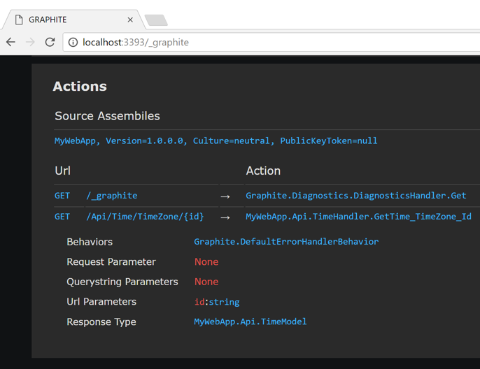

### Getting Started

You can either start out with a new empty web project or with an existing one as Graphite can coexist with your existing Web Api controllers.

If you are hosting with ASP.NET, install the following package if it is not already installed:

```bash
PM> Install-Package Microsoft.AspNet.WebApi.WebHost
```

Next, install Graphite and an IoC container. Currently Graphite only supports StructureMap out of the box, but any IoC container can be plugged in.

```bash
PM> Install-Package GraphiteWeb
PM> Install-Package GraphiteWeb.StructureMap
```

Next we will bootstrap Graphite by adding the following to the `Global.asax`:

```csharp
using Graphite.StructureMap;
using System.Web.Http;
using Graphite;

namespace MyWebApp
{
    public class Global : HttpApplication
    {
        protected void Application_Start(object sender, EventArgs e)
        {
            var configuration = GlobalConfiguration.Configuration;

            configuration
                .InitializeGraphite(c => c
                    .EnableDiagnosticsInDebugMode()
                    .UseStructureMapContainer()
                    .ExcludeTypeNamespaceFromUrl<Global>());

            configuration.EnsureInitialized();
        }
    }
}
```

The first option enables the diagnostics page when the calling assembly is in debug mode. The second configures Graphite to use StructureMap. And the third configures a url convention. All of these will be discussed further below.

Next we'll write our first handler and action. Graphite handlers are analogous to Web Api controllers. Graphite uses the term "handler" as opposed to "controller" to encourage one verb per handler vs one resource per controller. This is simply a naming difference so you can group all your resource verbs into one handler if you want. You can even change the naming convention to look for classes ending with `Controller`: 

```csharp
configuration
    .InitializeGraphite(c => c
        .WithHandlerNameRegex("Controller$")...);
```

Handlers are simply POCO's with a name that ends with `Handler` and one or more actions with a name that begins with an HTTP verb (e.g. `Get`, `Post`, `Patch`, `Put`, `Delete`, etc.) For example, a handler with an action that returns the current time in a particular timezone:

```csharp
namespace MyWebApp.Api
{
    public class TimeModel
    {
        public DateTime Time { get; set; }
    }

    public class TimeHandler
    {
        public TimeModel GetTime_TimeZone_Id(string id)
        {
            return new TimeModel
            {
                Time = TimeZoneInfo.ConvertTime(DateTime.Now,
                    TimeZoneInfo.FindSystemTimeZoneById(id))
            };
        }
    }
}
```

The url for the action is determined by the conventions you specify in the configuration but we'll discuss the default conventions here. The http verb is determined by the action method name prefix. The url for this action is built as follows:

1. The handler namespace split by `.`.
2. The method name minus the verb prefix, split by `_`. Segments that match the name of an action parameter are considered url parameters.

So by default:

1. `MyWebApp.Api` --> `MyWebApp/Api`
2. `GetTime_TimeZone_Id` --> `Time/TimeZone/{id}`

These are concatenated, so the verb and url for this action would be `GET /MyWebApp/Api/Time/TimeZone/{id}`. 

We really don't want `MyWebApp` in our url so thats why we used the `.ExcludeTypeNamespaceFromUrl<Global>()` configuration option above. This will exclude the namespace of the `Global` class, `MyWebApp`, from the url, producing `/Api/Time/TimeZone/{id}` instead.

Conventions do a lot of magic and it can be difficult, especially at first, to know what they are doing. This is why Graphite ships with diagnostics out of the box. There you can see all your configuration and actions. By default the diagnostics url is `/_graphite`, simply start your web project and browse to that url. You can see our time action below:



